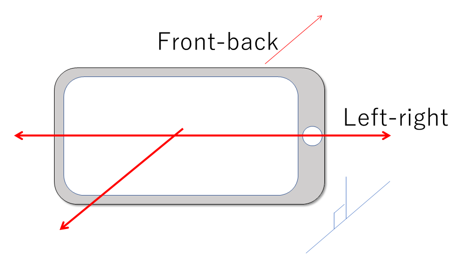
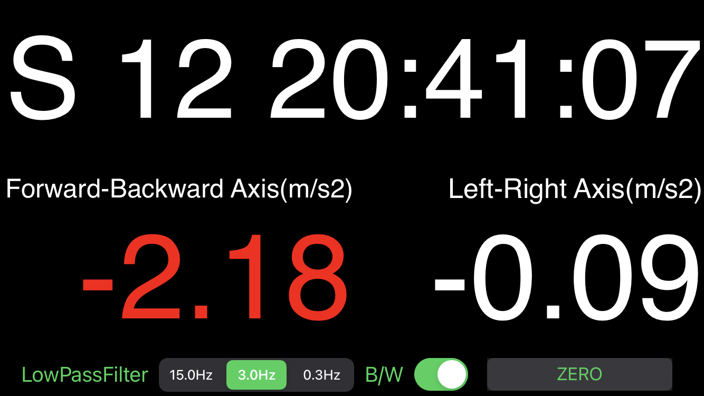
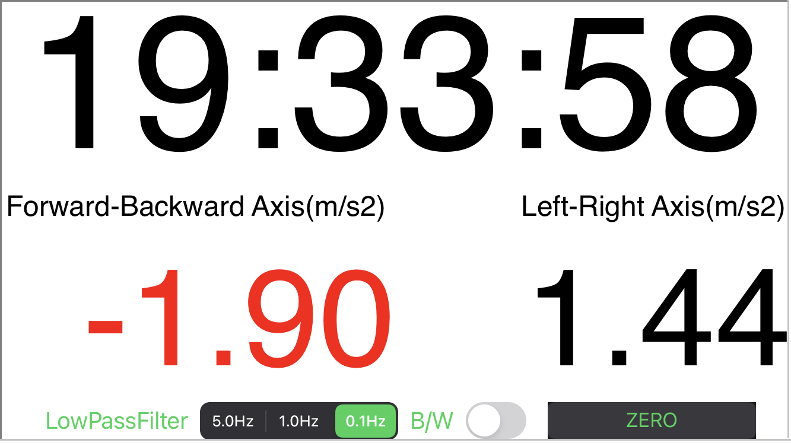
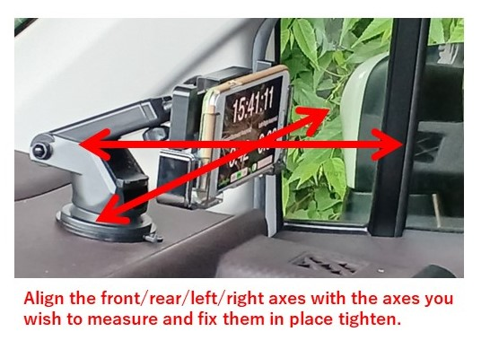
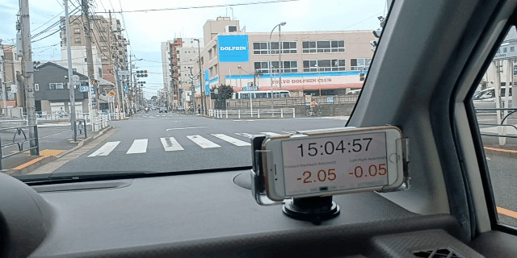
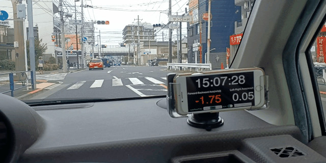

# Gdisp APP

<strong>Available on the App Store for iPhone and iPad running iOS 15.5 or later.（iOS 15.5以降のiPhone/iPadで利用できます）</strong>
[https://apps.apple.com/app/gdisp/id1639827054](https://apps.apple.com/app/gdisp/id1639827054)

## Objective / 目的

Gdisp is a simple acceleration display for measuring longitudinal and lateral acceleration.（縦横の加速度を表示するシンプルなアプリです）

## Feature / 機能

- Clock and two-axis acceleration display（時刻表示と2軸の加速度表示）
- Large characters for video recording（ビデオ撮影に適した大きな文字表示）
- Low-pass filter（ローパスフィルタ）
- Zero-offset button（ゼロ点ボタン）

## How to use / 使い方

### Clock / 時計

- Displays the current time.（時刻を表示します）
- The time zone follows your device settings.（タイムゾーンは端末の設定に従います）
- The display includes a three-letter month abbreviation and the day of the month.（月の3文字略語と日付を表示します）

### Acceleration / 加速度

- Displays acceleration on two axes: longitudinal and lateral.（前後・左右の2軸の加速度を表示します）
- The readings are shown without coordinate transformation.（座標変換は行いません）

### Zero button / 0点オフセットボタン

- Sets the current readings as the measurement zero point.（現在の値を測定のゼロ点に設定します）
- Press the button while the device is stationary and stable.（端末が静止し、安定しているときに押してください）
- This applies an offset only; it does not transform the coordinates.（オフセットのみを設定し、座標変換は行いません）

### LPF button / ローパスフィルタボタン

- Uses a first-order discrete low-pass filter.（1次の離散ローパスフィルタを使用します）
- Internal calculations run at 100 Hz.（内部計算は100 Hzで行います）
- With the 3.0 Hz setting, the response reaches approximately 63% in 0.3 seconds.（3.0 Hz設定では0.3秒で約63%応答します）

### B/W button / 背景色ボタン

- Switches between black and white backgrounds.（背景色を切り替えます）
- The readings turn red above +1.5 or below -1.5 m/s2.（+1.5または-1.5 m/s2を超えると数値が赤くなります）

 

 

## Tips / 利用上の注意

* Adjust the zero point whenever the device's static conditions change.（静止条件が変わるたびにゼロ点を調整してください）

* Secure the entire smartphone firmly before using the app.（使用前にスマートフォン全体をしっかり固定してください）

 

* White background longitudinal acceleration test (白背景での使用例)

 

* Black background longitudinal acceleration test (黒背景での使用例)

 

## Support

For help or questions, please use the [support form](https://forms.gle/8qG3hEu8UAZsDXZX9).（ご質問やお困りの際はサポートフォームをご利用ください）
