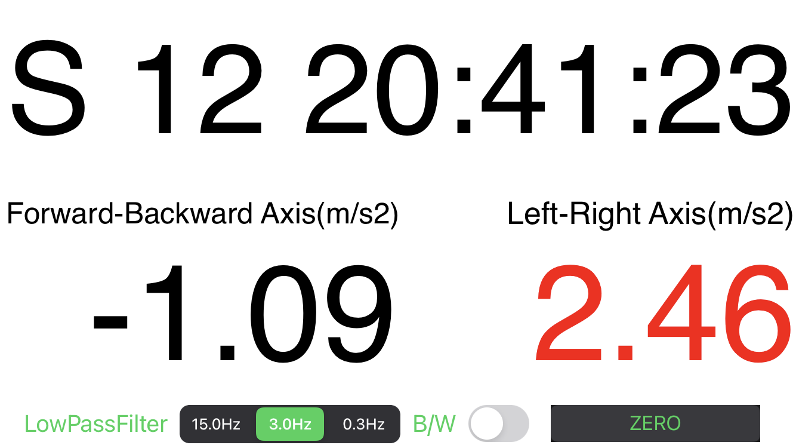

# Gdisp APP

<strong>You can get at App Store for iPhone/iPad ( iOS 15.5 ) </strong>

## Objective / 目的

Easy and simple to get longitudinal and lateral acceleration (縦横の加速度を表示します)

## Feature / 機能

- Clock and 2-axis acceleration indicator (時刻表示と加速度表示)
- Large text display for video logging (ビデオ撮影のための大型文字)
- LowPassFilter (ローパスフィルタ)
- Zero offset buttom（ゼロ点ボタン）

## How to use / 使い方

### Clock / 時計

- Simple clock（時計表示）
- Time zone is depend on your device setting（時差は端末設定依存）

### Acceleration / 加速度

- This App display acceleration value with 2 axis（前後左右の2軸）
- No coordinate transformation（座標変換はしていません）

### Zero buttom / 0点オフセットボタン

- Set the current value to the zero point of the measurement（水平で静止中にゼロ点ボタンを押してください）
- Push when Unmoving, calm situation
- its just offset no coordinate transformation

### LPF buttom / ローパスフィルタボタン

- Using a first-order filter（1次の離散ローパスフィルタ）
- 100Hz internal calculation（内部は100Hzで計算）
- 3.0Hz filter means 0.3sec at 63% response（3Hz=63%応答が0.3sec）

### B/W buttom / 背景色ボタン

- Change background color（背景色変更）
- Font change to Red when over +1.5 or under -1.5 m/s2 (±1.5m/s2を超えると赤文字)

 

 

## Tips / 利用上の注意

* The zero point should be adjusted frequently (ゼロ点は頻繁に調整してください。)

* When using the device, please fix the entire smartphone firmly in place (しっかりと固縛してください)

 

* White background longitudinal acceleration test (白背景での使用例)

 

* Black background longitudinal acceleration test (黒背景での使用例)

 

## Support or Contact

Having trouble with APP? Tell me via [QA Form .](https://forms.gle/8qG3hEu8UAZsDXZX9)　(質問はこちらまで)
